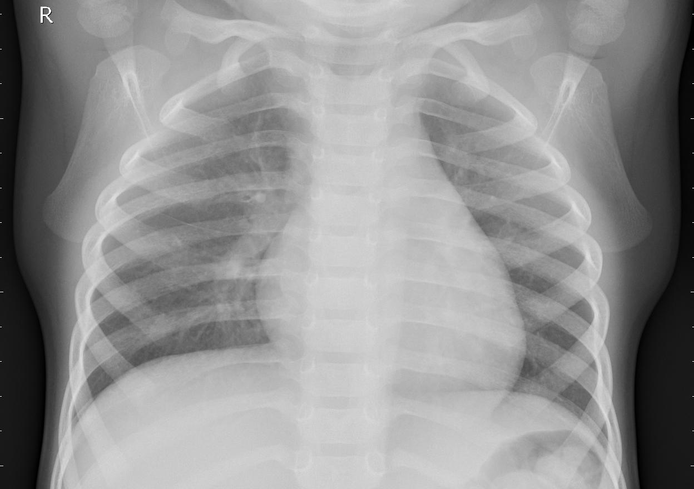

# Introdution

Use CNN model to diagnosis pneumonia from x-ray image. 

Sample image in dataset:

Dataset is downloaded from: https://www.kaggle.com/datasets/praveengovi/coronahack-chest-xraydataset

# Method

1. Build AlexNet model: https://www.kaggle.com/code/luukhang/build-alexnet-to-classifies-pneumonia
2. Fine tune VGG16 model: https://www.kaggle.com/code/luukhang/transfer-learning-vgg16-to-classifies-pneumonia
3. Fine tune ResNet model: https://www.kaggle.com/code/luukhang/transfer-learning-resnet18-to-classifies-pneumonia

